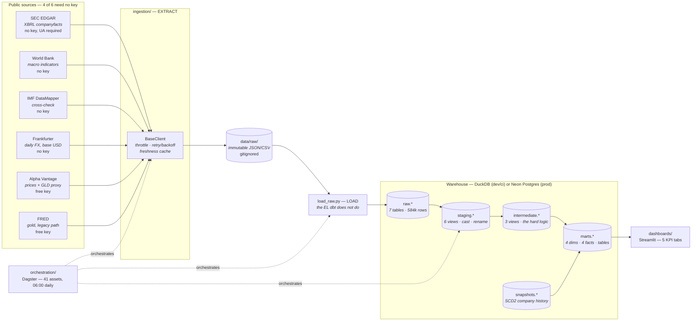
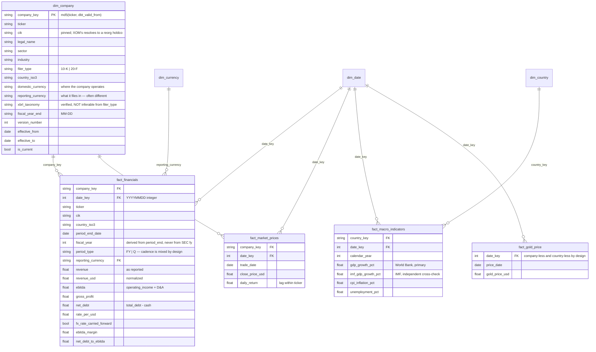
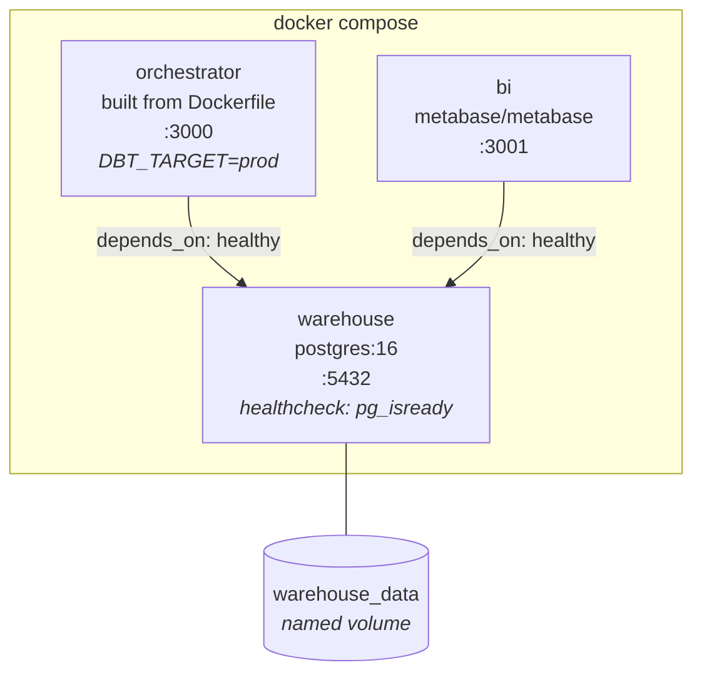

# Architecture

The physical and logical layout of the Kubera_EDW warehouse: where every byte lives, what shape
it takes at each stage, and the exact mechanics of every transformation between them.

For the repo tour, quickstart, and coverage universe, see [README.md](README.md).

Diagrams are Mermaid rather than committed images — GitHub renders them inline, they stay
diffable in version control, and they cannot silently go stale the way an exported PNG does.

---

## 1. Storage topology

Data changes physical form four times between a public API and a dashboard. Each boundary is
deliberate.

| Stage | Physical form | Location | Written by | Survives `make clean`? |
|---|---|---|---|---|
| 1. Extracted | JSON / CSV files | `data/raw/<source>/` | `ingestion/*_client.py` | **Yes** |
| 2. Loaded | Warehouse tables | `raw.*` schema | `ingestion/load_raw.py` | Yes (in the DB) |
| 3. Staged / intermediate | **Views** — no bytes | `staging.*`, `intermediate.*` | dbt | Rebuilt on demand |
| 4. Marts | **Tables** — materialized | `marts.*` | dbt | Rebuilt on demand |

### Why raw lands as files first

Extraction and transformation fail for completely different reasons, on completely different
schedules. Landing to disk decouples them:

- **Re-runnability.** The warehouse can be dropped and rebuilt from scratch without re-hitting
  a single rate-limited API. Alpha Vantage's free tier allows ~25 requests/day; a warehouse
  rebuild that needed live prices would be unbuildable by mid-morning.
- **Auditability.** The exact bytes the API returned are on disk. When a number looks wrong you
  can diff the response, not guess at it.
- **Immutability.** Nothing rewrites a landed file in place. A re-fetch writes a new file.

`data/raw/` is gitignored except for `.gitkeep`. Landed data is never committed.

### Why a Python loader instead of SQL reading the files

DuckDB can read local JSON directly (`read_json_auto`). Hosted Postgres cannot — it has no
access to your laptop's filesystem. If the raw layer were SQL reading files, the dbt models
would have to diverge between the `dev` and `prod` targets.

Parsing in Python and writing tables keeps **every dbt model byte-identical across all three
targets**. The adapter difference stops at `load_raw.py`.

---

## 2. End-to-end data flow



### The funnel

The row counts tell the story of what transformation actually does here:

| Stage | Rows | |
|---|---:|---|
| `raw.sec_edgar_facts` | 548,425 | Every XBRL fact ever filed, every restatement, every taxonomy |
| `intermediate.int_financials_cleaned` | 1,284 | After concept mapping, dedup, and period classification |
| `marts.fact_financials` | 1,284 | Plus company version resolution and USD conversion |

**Three orders of magnitude.** 548k raw facts collapse to 1,284 analytically meaningful rows.
Everything in §5 explains where the other 547,000 went and why.

---

## 3. Schema-by-schema layout

### `raw` — loaded by Python, never written by dbt

| Table | Rows | Grain |
|---|---:|---|
| `sec_edgar_facts` | 548,425 | company × taxonomy × concept × unit × period × filing |
| `fx_rates` | 29,600 | rate_date × currency (unpivoted, base USD) |
| `market_prices` | 3,700 | ticker × trade_date (OHLCV) |
| `imf_macro` | 1,349 | country × year × indicator |
| `world_bank_macro` | 1,152 | country × year × indicator, carries `loaded_at` |
| `gold_prices` | 100 | date × value (`value_raw` keeps `"."` missing markers) |
| `companies` | 38 | the universe, as loaded |

`world_bank_macro` carries `loaded_at` because **macro data is revised**. A GDP figure for 2022
is not the same number in 2023 as it is in 2025. Keeping the load date makes revision auditable
rather than silently overwriting history.

`gold_prices.value_raw` is deliberately `varchar`. FRED encodes missing observations as the
string `"."`. Casting on load would either crash or silently produce nulls without recording
that a value was *reported as missing* rather than *absent*.

### `staging` — views, one per raw table

| View | Rows | Job |
|---|---:|---|
| `stg_sec_edgar__financials` | 548,425 | Cast dates and values, split taxonomy/concept, name columns |
| `stg_fx__rates` | 29,600 | `rate_date`, `currency_iso`, `rate_per_usd` |
| `stg_prices__daily` | 3,700 | Typed OHLCV |
| `stg_imf__macro` | 1,349 | Typed country-year indicators |
| `stg_world_bank__macro` | 1,152 | Typed country-year indicators |
| `stg_gold__prices` | 100 | `value_raw` → typed, `"."` → null |

**Rule: 1:1 with a raw table. No joins, no business logic, no filtering.** Staging exists so
that every downstream model reads clean, correctly-typed columns with predictable names.
Row counts are identical to `raw` because staging never drops a row.

Materialized as **views** — they are cheap projections and materializing them would double
storage for no gain.

### `intermediate` — views, where the hard logic lives

| View | Rows | Does |
|---|---:|---|
| `int_financials_cleaned` | 1,284 | Concept mapping, restatement dedup, period classification, fiscal-year derivation |
| `int_fx_daily` | 53,633 | Gap-filled daily FX for every currency, plus synthetic USD |
| `int_prices_usd_normalized` | 3,700 | Prices converted to USD at each trade date's rate |

`int_fx_daily` is **larger** than `stg_fx__rates` (53,633 vs 29,600) because it fills weekends
and holidays — see §5.4.

### `snapshots` — SCD2 history

| Table | Rows | Strategy |
|---|---:|---|
| `company_snapshot` | 38 | `check` on 7 columns |

A dbt snapshot over `seed_companies`, keyed on `ticker`, watching `sector`, `industry`,
`filer_type`, `country_iso3`, `currency_iso`, `reporting_currency`, `xbrl_taxonomy`. When any of
those change, dbt closes the old row and opens a new one. This is the input to `dim_company`.

Currently 38 rows — one version per company, because the universe has not yet changed since
inception. The machinery is what matters: reclassify a company's sector tomorrow and you get a
second version with the correct effective dates, and every historical fact stays attached to
the version that was live when it was reported.

### `marts` — tables, the only layer BI reads

**Dimensions**

| Dimension | Rows | Cols | Grain |
|---|---:|---:|---|
| `dim_company` | 38 | 16 | one row per company **version** (SCD2) |
| `dim_date` | 11,323 | 11 | one row per calendar day, 2000-01-01 → 2031-01-01 |
| `dim_country` | 13 | 5 | one row per country in the universe |
| `dim_currency` | 11 | 5 | one row per currency in use |

**Facts**

| Fact | Rows | Cols | Grain |
|---|---:|---:|---|
| `fact_financials` | 1,284 | 31 | company version × period_end_date × period_type |
| `fact_market_prices` | 3,400 | 10 | company version × trade_date |
| `fact_macro_indicators` | 208 | 16 | country × year |
| `fact_gold_price` | 100 | 6 | date |

Materialized as **tables**, not views. Marts are read repeatedly by BI with a 5-minute cache;
paying the build cost once beats recomputing a 548k-row scan on every dashboard interaction.

---

## 4. The star schema

Conformed dimensions are shared across facts, which is what lets a single query join filing
fundamentals, daily prices and country macro together.



Every relationship above is enforced by a dbt `relationships` test — they are not decorative.

### `date_key` encoding

`date_key` is an integer in `YYYYMMDD` form, computed as:

```sql
extract(year from period_end_date) * 10000
+ extract(month from period_end_date) * 100
+ extract(day from period_end_date)
```

Integer keys join faster than dates, sort chronologically as integers, and are readable at a
glance in a query result — `20250630` is unambiguous in a way a serial surrogate key is not.

### Why `dim_date` has no fiscal columns

The universe spans **five distinct fiscal year-ends**: September 26 (AAPL), January 3 (JNJ),
June 30 (BHP, DEO, MSFT, PG), March 31 (BABA, HMC, INFY, MUFG, SONY, TM, WIT) and December 31
(the remaining 25).

A shared `fiscal_year` column on `dim_date` would have to pick one calendar, and would then be
wrong for most of the portfolio. So `dim_date` carries **calendar attributes only** —
`calendar_year`, `calendar_quarter`, `calendar_month`, `day_of_week`, `is_weekday`,
`is_month_end`, `is_quarter_end`, `is_period_end` — and fiscal period travels on the fact,
where it is company-specific and correct.

### Why `fact_gold_price` has no company or country key

It is a single global series — one gold price per day, for everyone. Forcing a company key
would mean either duplicating the series 38 times or inventing a null-company sentinel. It is
a cross-cutting benchmark, and the schema says so.

---

## 5. Transformation mechanics

This is where the 548,425 raw facts become 1,284 analytical rows. Each subsection is a real
problem in real SEC data, not a hypothetical.

### 5.1 Non-uniform tagging → `seed_concept_map`

The same economic concept appears under different XBRL tags across companies, and under
entirely different taxonomies (`us-gaap` vs `ifrs-full`). "Revenue" alone appears as:

| Tag | Taxonomy | Priority |
|---|---|---:|
| `RevenueFromContractWithCustomerExcludingAssessedTax` | us-gaap | 1 |
| `Revenue` | ifrs-full | 2 |
| `RevenueFromContractsWithCustomers` | ifrs-full | 3 |
| `Revenues` | us-gaap | 4 |
| `SalesRevenueNet` | us-gaap | 5 |
| `RevenueFromSaleOfGoods` | ifrs-full | 6 |
| `RevenueAndOperatingIncome` | ifrs-full | 7 |

`seed_concept_map` resolves `(xbrl_tag, taxonomy) → canonical_concept` with a **priority order**,
so when a company tags the same period under two acceptable tags, the more specific one wins.

Seven canonical concepts are mapped: `revenue`, `cost_of_revenue`, `operating_income`,
`net_income`, `depreciation_amortization`, `cash_and_equivalents`, `total_debt`.

Three more are **derived**, not mapped:

```sql
operating_income + depreciation_amortization  as ebitda
revenue          - cost_of_revenue            as gross_profit
total_debt       - cash_and_equivalents       as net_debt
```

`ebitda` is null wherever D&A is untagged — which is honest. A company that does not tag D&A
does not get a silently-wrong EBITDA.

**Toyota is the sharp case.** It *migrated* taxonomies mid-history: `us-gaap` for FY2009-2020,
`ifrs-full` for FY2021+. One company needs both namespaces across its own timeline. The concept
map handles this without special-casing, because it joins on `(tag, taxonomy)` rather than
assuming a company has one taxonomy forever.

### 5.2 Restatements → filed-date dedup

`companyfacts` carries **every version of a fact ever filed**. A single
`(company, concept, period)` has many rows from successive filings — a FY2025 10-K restates
FY2023 and FY2024 comparatives, and all of them are in the API response.

```sql
row_number() over (
    partition by cik, canonical_concept, period_end_date, duration_type
    order by filed_date desc, priority asc
) as pick
```

Keep `pick = 1`: the **most recently filed** value, breaking ties on concept-map priority. This
gives the figure as currently understood, which is what an analyst wants — not the number as
originally reported and since corrected.

### 5.3 YTD partials → duration classification

XBRL duration facts include year-to-date spans — 6-month and 9-month periods, often tagged with
a quarter label. Summing those alongside true quarters double-counts revenue.

Periods are classified by their **actual measured day span**, never by their label:

```sql
case
    when period_start_date is null       then 'instant'      -- balance sheet
    when period_days between 350 and 380 then 'annual'
    when period_days between  80 and 100 then 'quarterly'
    else                                      'partial'      -- YTD — dropped
end as duration_type
```

`partial` rows are discarded. `instant` facts (cash, debt — balance-sheet items with no
duration) are pivoted separately and joined back on `period_end_date`.

### 5.4 The `fy` trap → fiscal year from period, not filing

**This is the subtlest bug in the whole pipeline, and it is not obvious.**

SEC's `fy` and `fp` fields describe the **filing a fact appeared in**, not the period the fact
measures. A FY2025 10-K restates FY2023 and FY2024 comparatives — and tags all of them `fy=2025`.

Grouping on `fy` therefore produces several rows per fiscal year, each actually measuring a
different period. The grain silently breaks.

So the period grain comes from the fact's **own** `period_end_date` and measured duration, and
fiscal year is derived from that date against the company's own fiscal calendar:

```sql
case
    when extract(month from period_end_date) > fiscal_year_end_month
        then extract(year from period_end_date) + 1
    else extract(year from period_end_date)
end as fiscal_year
```

`fy` and `fp` are **never** used to define grain.

### 5.5 FX gap-filling → `int_fx_daily`

Markets close. Frankfurter publishes no rate on weekends or holidays, but companies have period
ends on those dates — and a period end with no rate means a null USD figure.

The fill is a **carry-forward via a gapless window**:

1. **Scaffold** — cross join `dim_date` × every currency, bounded by the first and last observed
   rate date plus `fx_max_carry_forward_days` (default **7**).
2. **Group** — a running `count()` of non-null rates per currency assigns every gap row the
   group number of the last observed rate:
   ```sql
   count(rate_per_usd) over (
       partition by currency_iso
       order by rate_date
       rows between unbounded preceding and current row
   ) as fill_group
   ```
3. **Fill** — `max(rate_per_usd) over (partition by currency_iso, fill_group)` propagates the
   observed rate across its gap.
4. **Flag** — `is_carried_forward` marks every filled row, so a downstream consumer can tell a
   real rate from an inferred one. This flag rides all the way onto `fact_financials` as
   `fx_rate_carried_forward`.

The 7-day cap is a guard: if a currency stops publishing entirely, the pipeline should produce
nulls rather than silently carry a stale rate forward for months.

**USD is synthesized, not fetched.** A `union all` appends `rate_per_usd = 1.0` for every date,
because Frankfurter's USD-based series does not include USD itself. Without this, every US
company's `revenue_usd` would be null. `assert_usd_reporters_rate_is_one` guards it.

This is why `int_fx_daily` has 53,633 rows against `stg_fx__rates`'s 29,600.

### 5.6 Version resolution → attaching facts to the right company version

With SCD2 dimensions, a fact must attach to the company version that was **live when the fact
was reported**, not simply the current one.

```sql
row_number() over (
    partition by cik, period_end_date, period_type
    order by
        case when effective_from <= period_end_date then 0 else 1 end,
        case when effective_from <= period_end_date then effective_from end desc,
        effective_from asc
) as version_pick
```

Read as: prefer versions effective **at or before** the period end; among those take the latest;
if none qualify (a fact predating the universe's inception) fall back to the earliest version so
the row is never silently dropped.

### 5.7 USD normalization

Conversion happens at the **period end date's** rate, joining `reporting_currency` — not
domestic currency:

```sql
revenue / rate_per_usd as revenue_usd
```

The `reporting_currency` vs `domestic_currency` distinction matters for 12 holdings.
AstraZeneca is British and operates in GBP but **files in USD**; converting its reported figures
at a GBP rate would inflate every number by roughly 27%. Unilever is British but reports in EUR.
Getting this wrong is silent — the numbers still look plausible.

Margins are computed on **as-reported** values, not USD, because a ratio is currency-invariant
and dividing two converted numbers just adds float noise:

```sql
ebitda       / nullif(revenue, 0)  as ebitda_margin
net_debt     / nullif(ebitda,  0)  as net_debt_to_ebitda
```

`nullif(…, 0)` prevents division-by-zero from killing the build on a company with a zero-revenue
period.

---

## 6. Deployment targets

### The three targets

| Target | Adapter | Path / host | `LOAD_TARGET` |
|---|---|---|---|
| `dev` | duckdb | `{{ env_var('DUCKDB_PATH', '../data/kubera_edw.duckdb') }}` | `duckdb` |
| `ci` | duckdb | `target/ci.duckdb` | `duckdb` |
| `prod` | postgres | `$POSTGRES_HOST` (Neon) | `postgres` |

`scripts/pipeline.sh` maps the target to `LOAD_TARGET` and exports it, so the Python loader and
dbt always agree on where the warehouse is.

### Schema routing

`macros/generate_schema_name.sql` overrides dbt's default, which would otherwise prefix custom
schemas with the target schema (`public_marts` instead of `marts`):

```sql

    {{ target.schema }}
    {{ custom_schema_name | trim }}

```

So `staging`, `intermediate`, `marts` and `snapshots` are literal schema names on **both**
adapters. A query written against `marts.dim_company` works identically on DuckDB and Postgres.

### Cross-adapter typing

`macros/type_money.sql` resolves to `double precision`. DuckDB and Postgres spell numeric types
differently; routing money columns through one macro keeps model SQL portable. dbt's own
`dbt.type_int()` is used the same way for integer casts.

### Neon (hosted Postgres)

Neon is serverless Postgres. Three things matter:

1. **TLS is mandatory.** `PGSSLMODE=require` — the profile defaults to `require` rather than
   leaving it to the client.
2. **Cold starts.** A scale-to-zero branch takes seconds to wake. The profile sets
   `connect_timeout: 30` and `keepalives_idle: 30` so the first connection of the day doesn't
   fail while the compute spins up.
3. **The connection string is split, never pasted whole.** `.env` carries `POSTGRES_HOST`,
   `POSTGRES_USER`, `POSTGRES_PASSWORD`, `POSTGRES_DB`, `POSTGRES_PORT`, `POSTGRES_SCHEMA`
   separately. Neon's dashboard hands you
   `postgresql://<USER>:<PASSWORD>@<HOST>/<DB>?sslmode=require` — split it into the parts.
   A whole URL in one variable tends to end up in a log line or a shell history.

Running to prod:

```bash
make prod          # LOAD_TARGET=postgres, dbt build --target prod
```

`load_raw._write_postgres()` handles the write; every dbt model downstream is unchanged.

### Containers



`orchestrator` and `bi` both wait on `service_healthy`, not merely `service_started` — Postgres
accepts TCP connections before it is ready to serve queries, and starting Dagster against a
not-yet-ready database produces a confusing failure at import time.

**The Dockerfile bakes `dbt parse` into the image.** `@dbt_assets` needs `manifest.json` at
*import time* to construct the asset graph. Generating it at container start would mean the
Dagster code location fails to load on a cold boot, before any dbt command has ever run. The
parse is `|| echo`-guarded so an unreachable warehouse at build time doesn't fail the image.

### Orchestration runtime

`DAGSTER_HOME=/app/dagster_home` is set explicitly. Without it Dagster falls back to a temp
directory and loses run history, schedules, and sensor state on every restart.

The daily schedule is `DefaultScheduleStatus.STOPPED`. Importing the module never starts a
06:00 job on someone's laptop; it has to be turned on deliberately in the UI.

---

## 7. Testing

| Layer | What runs | Count |
|---|---|---:|
| Python | pytest, HTTP mocked with `respx` | 83 |
| dbt | schema tests (unique, not_null, relationships, accepted_values) | 65 |
| dbt | unit tests (`_unit_tests.yml`) | 3 |
| dbt | custom data tests (`dbt/tests/*.sql`) | 4 |
| **dbt total** | `dbt build` nodes | **96** |

### The four custom tests

| Test | Guards |
|---|---|
| `assert_one_current_company_version_per_ticker` | SCD2 correctness — two live rows for one ticker would silently double every joined fact |
| `assert_usd_reporters_rate_is_one` | The synthetic USD row in §5.5 — if it regresses, every US company's USD figures go null |
| `assert_fx_currencies_are_modelled` | Every `reporting_currency` in use has FX coverage; adding a company in a new currency fails loudly rather than producing nulls |
| `assert_quarterly_reconciles_to_annual` | Four quarters ≈ the annual figure. **Warn-level, not error** — legitimate gaps exist where a 20-F filer reports annually only. |

`assert_quarterly_reconciles_to_annual` currently warns with 1 result. That is expected: the
universe mixes 10-K quarterly cadence with 20-F annual-only cadence by design.

### Why CI never touches the network

`dbt/seeds/ci_raw/` holds six committed CSV fixtures — one per raw table — loaded into the `raw`
schema when `target.name == 'ci'`:

```yaml
ci_raw:
  +schema: raw
  +enabled: "{{ target.name == 'ci' }}"
```

So `dbt build --target ci` exercises the **entire DAG** — every staging view, every intermediate
join, all 96 nodes — with no API keys, no secrets, and no flaky external dependency. It is also
what `make demo` uses, which is why a fresh clone reaches populated dashboards without a single
credential.

The fixtures deliberately include a 20-F annual-only `ifrs-full` filer alongside a US 10-Q
filer, so CI exercises the mixed-cadence, cross-taxonomy and relationship paths rather than a
happy-path sample.

---

## 8. Design decisions, condensed

| Decision | Reason |
|---|---|
| Raw lands as **files**, not straight to the warehouse | Extraction stays re-runnable and the warehouse rebuildable without re-hitting rate-limited APIs |
| A **Python loader** rather than SQL reading files | DuckDB can read local JSON; hosted Postgres cannot. Parsing in Python keeps dbt models byte-identical across targets. |
| **dbt owns transformation only** | Models are tested and versioned; the loader owns the EL that dbt deliberately does not do |
| Staging is **1:1 and logic-free** | A single place to look when a column is wrong; business logic never hides in a cast |
| `dim_date` carries **calendar attributes only** | Five fiscal calendars in the universe — a shared fiscal column would be wrong for most companies |
| `fact_gold_price` joins **only** on `dim_date` | A single global series, a cross-cutting benchmark rather than a per-holding measure |
| Fiscal year derived from **`period_end_date`**, never SEC `fy` | `fy` describes the filing, not the period — grouping on it silently breaks the grain |
| Marts are **tables**, staging/intermediate are **views** | Marts are read repeatedly under a cache; intermediate views are cheap projections |
| Company universe lives in **one YAML file** | `generate_seeds.py` derives the dbt seed from it, so it is never defined twice |
| Missing API key → **zero records, not an exception** | The pipeline delivers every source it can; one missing key shouldn't take the warehouse down |
