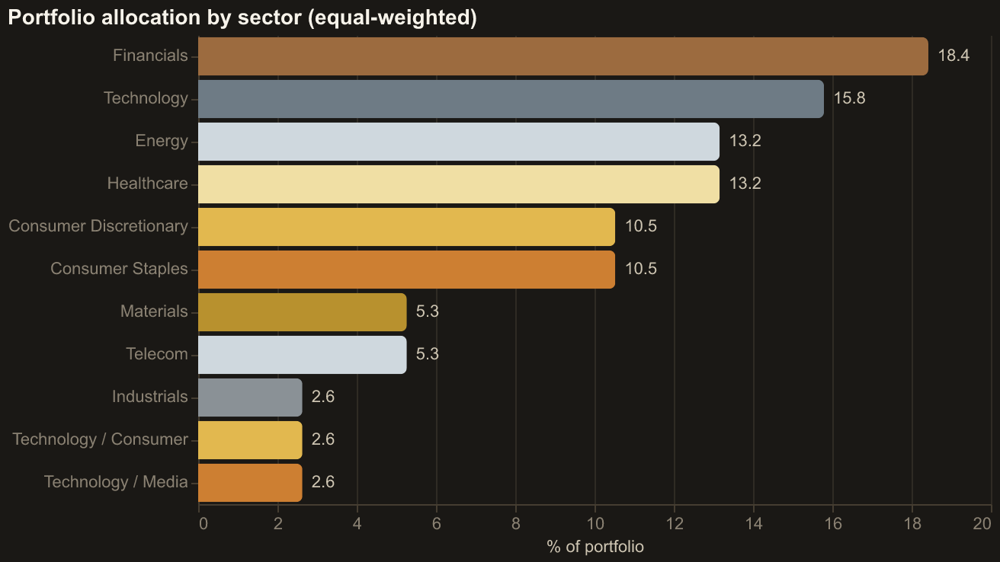
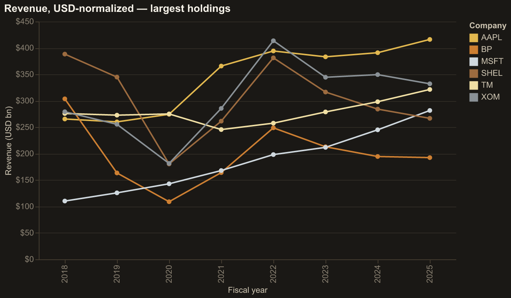
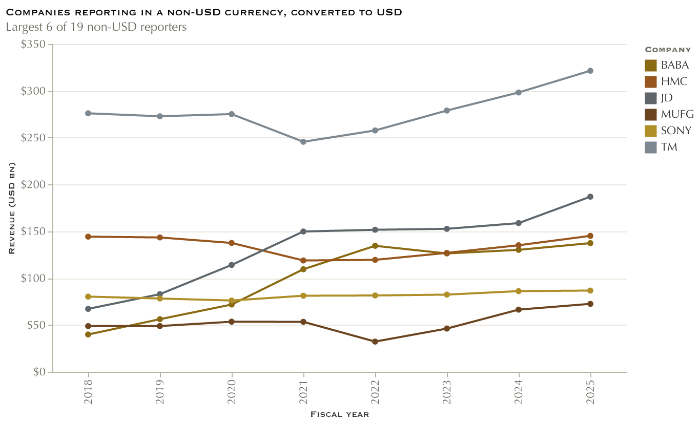
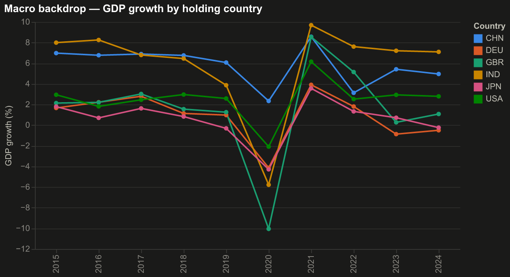
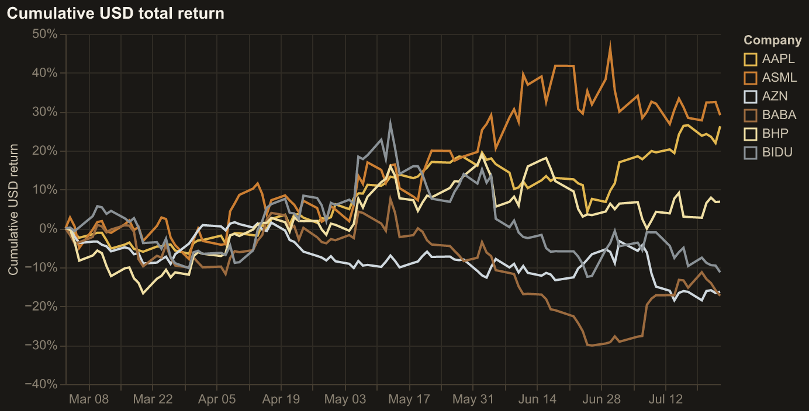

# Kubera_EDW

[](https://github.com/redtachyon19/kubera_edw/actions/workflows/ci.yml)

An end-to-end **enterprise data warehouse** for a fictional global asset management group,
built as a single monorepo: extraction, loading, transformation, orchestration, and BI.

Kubera holds **38 large publicly traded companies** across 13 countries and 11 currencies —
US 10-K filers alongside foreign 20-F filers reporting in EUR, JPY, GBP, CNY, KRW, INR, BRL,
CHF, MXN and AUD — plus two index benchmarks (SPY, ACWI). The warehouse answers portfolio
questions across that mix: allocation, USD-normalized fundamentals, FX impact on reported
results, market performance, and the macro backdrop of each holding country.

**Every data source is free and public.** Four of the six need no key at all. Nothing here
uses private, paid, or licensed data — the point is a realistic warehouse built entirely on
disclosed filings and open macro data.

> This is deliberately **public disclosed data**, not private operational data. It does not
> claim to replicate what a buyout firm sees internally (invoice-level transactions, private
> management accounts). That is a scope decision, stated plainly rather than left implied.

For the deep technical treatment — physical storage layout, schema-by-schema column detail,
and the mechanics of every transformation — see **[ARCHITECTURE.md](ARCHITECTURE.md)**.

---

## Quickstart

No API keys and no network required — the repo ships CI fixtures that build the full warehouse
offline.

```bash
make setup && make demo && make dashboard
```

| Command | What it does |
|---|---|
| `make setup` | Installs `uv`, Python 3.12, `.venv`, and all dependencies. No admin password. |
| `make demo` | Builds the warehouse from committed fixtures — **no keys, no network** |
| `make dashboard` | Serves the Streamlit BI app at http://localhost:8501 |
| `make pipeline` | Full live pipeline into local DuckDB (needs `.env` keys) |
| `make prod` | Full live pipeline into hosted Postgres / Neon |
| `make orchestrate` | Serves the Dagster UI at http://localhost:3000 |
| `make test` | Python suite + every dbt test |
| `make lint` | `ruff check` + `ruff format --check` |
| `make verify` | Re-checks environment: python, deps, lint, tests, dbt connection |
| `make universe` | Re-verifies every company against SEC EDGAR |
| `make screenshots` | Re-renders the dashboard charts from the live warehouse |
| `make clean` | Removes build artefacts (keeps landed raw data and the venv) |

---

## Repo directory

```
kubera_edw/
├── ingestion/                    # EXTRACT — one client per external source
│   ├── base_client.py            #   shared HTTP: throttle, retry/backoff, freshness cache, landing
│   ├── config_loader.py          #   companies.yml reader, .env loading, API-key placeholder detection
│   ├── sec_edgar_client.py       #   SEC EDGAR XBRL companyfacts
│   ├── world_bank_client.py      #   World Bank country-year macro indicators
│   ├── imf_client.py             #   IMF DataMapper (cross-check on World Bank)
│   ├── fx_client.py              #   Frankfurter daily FX, base USD
│   ├── prices_client.py          #   Daily equity prices (Alpha Vantage / Stooq)
│   ├── gold_price_client.py      #   Gold benchmark (FRED series or GLD proxy)
│   ├── generate_seeds.py         #   companies.yml -> dbt/seeds/seed_companies.csv
│   ├── load_raw.py               #   LOAD — parses data/raw/ into the warehouse raw schema
│   └── config/companies.yml      #   THE COVERAGE UNIVERSE — single source of truth
│
├── dbt/                          # TRANSFORM
│   ├── models/staging/           #   6 views — cast, rename, clean. No business logic.
│   ├── models/intermediate/      #   3 views — the hard logic (concept pivot, FX fill, USD normalize)
│   ├── models/marts/             #   8 tables — 4 conformed dimensions + 4 facts
│   ├── snapshots/                #   company_snapshot — SCD2 history of the universe
│   ├── seeds/                    #   concept map, country/currency reference, company seed
│   ├── seeds/ci_raw/             #   committed fixtures so CI builds with no network
│   ├── macros/                   #   generate_schema_name, type_money (cross-adapter money type)
│   ├── tests/                    #   4 custom data tests beyond schema tests
│   ├── dbt_project.yml           #   layer materializations + schema routing
│   └── profiles.yml              #   dev (DuckDB) | ci (DuckDB) | prod (Postgres/Neon)
│
├── orchestration/
│   └── dagster_pipeline.py       # 41 assets, 2 jobs, 1 failure sensor, 06:00 daily schedule
│
├── dashboards/streamlit_app/
│   ├── app.py                    # 5 KPI tabs
│   ├── queries.py                # SQL against marts -> pandas
│   ├── db.py                     # read-only warehouse connection, 5-min cache
│   └── theme.py                  # shared palette, light/dark aware
│
├── scripts/
│   ├── bootstrap.sh              # uv + Python 3.12 + venv + deps
│   ├── pipeline.sh               # extract -> seeds -> load -> dbt build
│   ├── verify.sh                 # environment health check
│   ├── verify_universe.py        # re-validates every company against SEC EDGAR
│   └── generate_screenshots.py   # renders dashboard charts to docs/screenshots/
│
├── tests/                        # 83 pytest tests (mocked HTTP via respx)
├── docs/                         # screenshots
├── data/                         # kubera_edw.duckdb + data/raw/ landing zone (gitignored)
│
├── Makefile                      # every workflow above
├── Dockerfile                    # orchestrator image
├── docker-compose.yml            # postgres warehouse + dagster orchestrator + metabase
├── requirements.txt
└── .github/workflows/ci.yml      # lint + test, then a full offline dbt build
```

---

## Ingestion

Ingestion is **extract-and-land only**. Each client fetches from a public API and writes the
response to `data/raw/<source>/` essentially as received. No reshaping, no business logic, no
type coercion — that is deliberately deferred so extraction stays re-runnable and the warehouse
can be rebuilt without re-hitting rate-limited APIs.

A separate step, `load_raw.py`, parses those landed files into warehouse tables. So the flow is
genuinely **E → L → T**: extract to files, load to `raw.*`, transform in dbt.

### Sources

| Source | Purpose | Base URL | Key | Lands as |
|---|---|---|---|---|
| **SEC EDGAR** | XBRL company facts — every financial figure | `data.sec.gov` | none¹ | `companyfacts_CIK*.json` |
| **World Bank** | Country-year macro (GDP, inflation, unemployment) | `api.worldbank.org/v2` | none | `<indicator>_<date>.json` |
| **IMF DataMapper** | Independent cross-check on World Bank | `imf.org/external/datamapper/api/v1` | none | `<indicator>_<code>.json` |
| **Frankfurter** | Daily FX rates, base USD | `api.frankfurter.dev/v1` | none | `timeseries_USD_*.json` |
| **Alpha Vantage** | Daily equity prices + gold proxy | `alphavantage.co` | `ALPHA_VANTAGE_API_KEY` | `av_<TICKER>.json` |
| **FRED** | Gold benchmark (see note) | `api.stlouisfed.org/fred` | `FRED_API_KEY` | `gold_lbma_fixing.json` |

¹ SEC requires no key but **does** require a descriptive `SEC_EDGAR_USER_AGENT` identifying the
requester, in the form `"Name email@example.com"`. Requests without it are rejected.

**Gold note.** The original source, FRED series `GOLDAMGBD228NLBM` (LBMA daily fixing), no longer
exists — FRED returns `400 The series does not exist`. The default backend is now the **GLD ETF**
(SPDR Gold Shares, ~1/10 troy oz per share) via Alpha Vantage, which reuses the price key. The
FRED code path is retained and works if you pass an explicit `series_id`. Whichever backend runs,
the landed payload keeps FRED's `{"observations": [{date, value}]}` shape, so downstream staging
does not care which produced it.

**Prices note.** Stooq is still implemented but is bot-gated behind a JS check, so Alpha Vantage
is the default. `PRICES_BACKEND` switches it if Stooq ever un-gates.

### What every client inherits

`BaseClient` gives each source the same behaviour:

- **Throttle** — a minimum interval between requests (`0.15s` default; SEC `0.11s` to stay
  under 10 req/s; prices `1.3s` for free-tier limits)
- **Retry with exponential backoff** — via `tenacity`, only on genuinely retryable failures
  (HTTP 429, 5xx, and transport errors). A 404 fails immediately rather than burning retries.
- **Freshness cache** — a source already landed recently is skipped, so re-runs don't
  re-consume a daily quota
- **Landing** — `_land(name, payload)` writes to `data/raw/<source_name>/<name>.<ext>`

### Adding a new source

1. **Write the client** in `ingestion/`, subclassing `BaseClient`:

   ```python
   from .base_client import BaseClient


   class MySourceClient(BaseClient):
       source_name = "my_source"  # -> data/raw/my_source/
       base_url = "https://api.example.com/v1"
       min_interval_s = 0.5  # respect their rate limit

       def fetch_thing(self, arg: str) -> dict:
           payload = self._get(f"/things/{arg}").json()
           self._land(f"thing_{arg}", payload)
           return payload


   def main() -> None:
       from .config_loader import bootstrap

       bootstrap()
       with MySourceClient() as client:
           client.fetch_thing("abc")
   ```

   `main()` is the required entrypoint — the pipeline and Dagster both invoke it.

2. **Add a parser** in `load_raw.py` — a `parse_my_source() -> pd.DataFrame` function returning
   a tidy frame, then register it in `load_all()` so it lands as a `raw.*` table.

3. **Declare the raw table** in `dbt/models/staging/_sources.yml` under the `raw` source.

4. **Add a staging model** `dbt/models/staging/stg_my_source__thing.sql` — cast, rename, clean.
   No business logic; that belongs in `intermediate/`.

5. **Wire it into Dagster** in `orchestration/dagster_pipeline.py`: add an `@asset` calling
   `_run_extractor(context, my_source_client, "my_source")`, add the raw table to `RAW_TABLES`,
   and add the asset to both the `raw_tables` `deps` list and `Definitions(assets=[...])`.

6. **Commit a CI fixture** at `dbt/seeds/ci_raw/my_source.csv` so CI keeps building offline,
   and register its column types in `dbt_project.yml` under `seeds.kubera_edw.ci_raw`.

7. **Add tests** in `tests/` — mock the HTTP with `respx`, and add a malformed-response case to
   `test_malformed_responses.py`.

If the source needs a key, add it to `.env.example` and read it via
`config_loader.api_key("MY_KEY")`, which returns `None` for unset **or** placeholder values.

---

## dbt layers

Data moves through four schemas, each with one job. The layer boundaries are enforced by
materialization and naming, not convention alone.

```
raw.*            loaded by Python, never written by dbt
  └─ staging.*        views  — cast, rename, clean. 1:1 with a raw table. No joins, no logic.
       └─ intermediate.*  views  — the hard logic. Joins, pivots, dedup, FX fill.
            └─ marts.*        tables — conformed dimensions + facts. What BI reads.
```

| Layer | Materialization | Models | Rule |
|---|---|---|---|
| `staging` | view | 6 | One per raw table. Rename and cast only. |
| `intermediate` | view | 3 | Business logic lives here and nowhere else. |
| `marts` | **table** | 8 | 4 dimensions + 4 facts. The only layer BI queries. |
| `snapshots` | table | 1 | SCD2 history of the company universe. |

### Marts — the star schema

**Dimensions** (conformed, shared across facts):

| Dimension | Grain | Notes |
|---|---|---|
| `dim_company` | one row per company **version** | SCD2 — `is_current` flags the live row |
| `dim_date` | one row per calendar day | 2000-01-01 → 2031-01-01. **Calendar attributes only.** |
| `dim_country` | one row per country | joined to region/sub-region reference |
| `dim_currency` | one row per currency | ISO code, name, minor-unit digits |

**Facts:**

| Fact | Grain | Joins to |
|---|---|---|
| `fact_financials` | company × period (FY or Q) | `dim_company`, `dim_date`, `dim_currency` |
| `fact_market_prices` | company × trade date | `dim_company`, `dim_date` |
| `fact_macro_indicators` | country × year | `dim_country`, `dim_date` |
| `fact_gold_price` | date only | `dim_date` |

`dim_date` carries **calendar** attributes only — no fiscal columns. The universe spans five
distinct fiscal calendars (Sep, Jan, Jun, Mar, Dec year-ends), so a shared fiscal column would
be wrong for most companies. Fiscal period travels on the fact instead.

`fact_gold_price` joins only on `dim_date` by design — it is a single global series, a
cross-cutting benchmark rather than a per-holding measure.

### Seeds

| Seed | Rows | Purpose |
|---|---|---|
| `seed_companies` | 38 | Generated from `companies.yml` by `generate_seeds.py` — never hand-edited |
| `seed_concept_map` | 24 | Maps XBRL tag → canonical concept, with priority. **The key to cross-taxonomy comparability.** |
| `country_regions` | 15 | ISO3 → country name, region, sub-region |
| `currency_names` | 14 | ISO → currency name, minor-unit digits |
| `ci_raw/*` | 6 files | Committed raw fixtures so CI builds the full DAG with no network |

### Tests

`dbt build` runs **96 nodes** including 65 schema tests, 3 unit tests, and 4 custom data tests:

| Test | Asserts |
|---|---|
| `assert_one_current_company_version_per_ticker` | SCD2 never produces two live rows for one ticker |
| `assert_usd_reporters_rate_is_one` | USD reporters get exactly `rate_per_usd = 1` |
| `assert_fx_currencies_are_modelled` | Every reporting currency in use has FX coverage |
| `assert_quarterly_reconciles_to_annual` | Four quarters ≈ the annual figure (warn-level) |

---

## Orchestration

Dagster models the whole pipeline as **one asset graph** — 41 assets, so the UI shows real
lineage from "SEC EDGAR companyfacts" all the way through marts, rather than one opaque
"run dbt" box.

```
extract (6 source assets)  →  load (6 raw table assets)  →  dbt (28 model/seed/snapshot/test assets)
```

| Piece | Detail |
|---|---|
| Extract assets | One `@asset` per source, `RetryPolicy(max_retries=3, delay=30, EXPONENTIAL)` |
| Seed asset | `dbt_seed_files` regenerates `seed_companies.csv` from `companies.yml` |
| Load asset | `raw_tables` — a `@multi_asset` emitting one asset per raw table |
| dbt assets | `@dbt_assets` reads the manifest, so every model/seed/snapshot/test is its own node |
| Job | `kubera_refresh` — full refresh, selection `*` |
| Schedule | `0 6 * * *` — 06:00 daily, **`DefaultScheduleStatus.STOPPED`** so it never auto-starts on import |
| Sensor | `kubera_run_failure_sensor` logs job failures for alerting/triage |

A source blocked on a missing API key is logged and reported as **zero records rather than
raised** — the pipeline still delivers every source it can, instead of one missing key taking
the whole warehouse down.

```bash
make orchestrate    # Dagster UI at http://localhost:3000
```

> `orchestration/dagster_pipeline.py` deliberately has **no** `from __future__ import annotations`.
> Dagster resolves the `context` parameter's annotation at runtime; PEP 563 would turn it into a
> string and the `@asset` decorator would reject it.

---

## Deployment

The same dbt project builds against three targets, selected by `--target`:

| Target | Adapter | Location | Used for |
|---|---|---|---|
| `dev` | DuckDB | `data/kubera_edw.duckdb` (or `$DUCKDB_PATH`) | Local development |
| `ci` | DuckDB | `dbt/target/ci.duckdb` | Offline CI + `make demo` |
| `prod` | Postgres | Neon (or any Postgres) via `$POSTGRES_*` | Hosted warehouse |

`load_raw.py` picks its writer from `LOAD_TARGET` — `duckdb` for dev/ci, `postgres` for prod —
so the Python loader and dbt stay pointed at the same place.

### Local

```bash
make pipeline          # extract -> seeds -> load -> dbt build, into DuckDB
```

### Hosted (Neon Postgres)

Set the connection parts in `.env` (`POSTGRES_HOST`, `POSTGRES_USER`, `POSTGRES_PASSWORD`,
`POSTGRES_DB`, `PGSSLMODE=require`), then:

```bash
make prod
```

Neon specifics — sslmode, connection strings, and why the loader parses files in Python rather
than letting SQL read them — are covered in [ARCHITECTURE.md](ARCHITECTURE.md).

### Containers

```bash
docker compose up -d
```

| Service | Image | Port | Role |
|---|---|---|---|
| `warehouse` | `postgres:16` | 5432 | Postgres warehouse, healthchecked, persistent volume |
| `orchestrator` | built from `Dockerfile` | 3000 | Dagster, `DBT_TARGET=prod` |
| `bi` | `metabase/metabase` | 3001 | Optional BI alternative to Streamlit |

The Dockerfile bakes `dbt parse` into the image, because `@dbt_assets` needs `manifest.json` at
**import time** to build the asset graph — generating it at container start would make the code
location fail to load on a cold boot.

### CI

`.github/workflows/ci.yml` runs two jobs:

1. **lint-and-test** — `ruff check`, `ruff format --check`, `pytest tests/ -v`
2. **dbt-build** — `dbt deps`, `dbt seed --target ci`, `dbt build --target ci`

The second job builds the **entire DAG offline** from the committed `ci_raw` fixtures. No secrets,
no network, no flaky external APIs in CI.

---

## Dashboards

```bash
make dashboard      # http://localhost:8501
```

A Streamlit app with five tabs, reading `marts.*` through a read-only connection with a
5-minute cache. Every chart ships its underlying table, so an analyst can sanity-check any
number they don't believe.

| Tab | Shows |
|---|---|
| **Portfolio Allocation** | Equal-weighted diversification by country, sector, currency, region |
| **Fundamentals** | Revenue growth, margins and leverage — all USD-normalized |
| **Market Performance** | Cumulative USD total return by holding |
| **FX Impact** | What currency movement did to reported results for non-USD reporters |
| **Macro Overlay** | GDP growth, inflation and unemployment for each holding country |

Every mart has an **empty state** — if a table has zero rows the tab explains why and prints
the command that fixes it, rather than crashing.

| | |
|---|---|
|  |  |
|  |  |



These are **rendered, not screenshotted**. `scripts/generate_screenshots.py` queries the live
warehouse, rebuilds each chart with Altair, and rasterizes the Vega-Lite spec via `vl_convert` —
so they cannot drift from the data. Regenerate with `make screenshots`.

Metabase is available as a containerized alternative (`docker compose up bi`, port 3001), but
Streamlit is the primary, reproducible deliverable.

---

## Coverage universe

38 companies, edited in **one place**: [`ingestion/config/companies.yml`](ingestion/config/companies.yml).
`generate_seeds.py` regenerates the dbt seed from it, so the universe is never defined twice.

Benchmarks: **SPY**, **ACWI**.

### United States — 10-K filers, us-gaap (9)

| Ticker | Company | Sector | Currency | FY end |
|---|---|---|---|---|
| AAPL | Apple Inc. | Technology | USD | 09-26 |
| CAT | Caterpillar Inc. | Industrials | USD | 12-31 |
| F | Ford Motor Co. | Consumer Discretionary | USD | 12-31 |
| JNJ | Johnson & Johnson | Healthcare | USD | 01-03 |
| JPM | JPMorgan Chase & Co. | Financials | USD | 12-31 |
| KO | Coca-Cola Co. | Consumer Staples | USD | 12-31 |
| MSFT | Microsoft Corp. | Technology | USD | 06-30 |
| PG | Procter & Gamble Co. | Consumer Staples | USD | 06-30 |
| XOM | Exxon Mobil Corporation | Energy | USD | 12-31 |

### Europe — 20-F filers (13)

| Ticker | Company | Country | Sector | Domestic | Reports in | Taxonomy |
|---|---|---|---|---|---|---|
| ASML | ASML Holding N.V. | Netherlands | Technology | EUR | EUR | us-gaap |
| AZN | AstraZeneca plc | United Kingdom | Healthcare | GBP | USD | ifrs-full |
| BP | BP plc | United Kingdom | Energy | GBP | USD | ifrs-full |
| DB | Deutsche Bank AG | Germany | Financials | EUR | EUR | ifrs-full |
| DEO | Diageo plc | United Kingdom | Consumer Staples | GBP | GBP | ifrs-full |
| GSK | GSK plc | United Kingdom | Healthcare | GBP | GBP | ifrs-full |
| HSBC | HSBC Holdings plc | United Kingdom | Financials | GBP | USD | ifrs-full |
| NVS | Novartis AG | Switzerland | Healthcare | CHF | USD | ifrs-full |
| SHEL | Shell plc | Netherlands/UK | Energy | GBP | USD | ifrs-full |
| SNY | Sanofi | France | Healthcare | EUR | EUR | ifrs-full |
| TTE | TotalEnergies SE | France | Energy | EUR | USD | ifrs-full |
| UBS | UBS Group AG | Switzerland | Financials | CHF | USD | ifrs-full |
| UL | Unilever plc | United Kingdom | Consumer Staples | GBP | EUR | ifrs-full |

### Asia-Pacific — 20-F filers (12)

| Ticker | Company | Country | Sector | Domestic | Reports in | Taxonomy |
|---|---|---|---|---|---|---|
| BABA | Alibaba Group Holding | China | Technology / Consumer | CNY | CNY | us-gaap |
| BHP | BHP Group Ltd. | Australia | Materials | AUD | USD | ifrs-full |
| BIDU | Baidu Inc. | China | Technology | CNY | CNY | us-gaap |
| HMC | Honda Motor Co. | Japan | Consumer Discretionary | JPY | JPY | ifrs-full |
| INFY | Infosys Ltd. | India | Technology | INR | USD | ifrs-full |
| JD | JD.com Inc. | China | Consumer Discretionary | CNY | CNY | us-gaap |
| KB | KB Financial Group | South Korea | Financials | KRW | KRW | ifrs-full |
| MUFG | Mitsubishi UFJ Financial Group | Japan | Financials | JPY | JPY | us-gaap |
| SKM | SK Telecom Co. | South Korea | Telecom | KRW | KRW | ifrs-full |
| SONY | Sony Group Corp. | Japan | Technology / Media | JPY | JPY | us-gaap |
| TM | Toyota Motor Corp. | Japan | Consumer Discretionary | JPY | JPY | ifrs-full |
| WIT | Wipro Ltd. | India | Technology | INR | INR | ifrs-full |

### Latin America — 20-F filers (4)

| Ticker | Company | Country | Sector | Domestic | Reports in | Taxonomy |
|---|---|---|---|---|---|---|
| AMX | America Movil SAB | Mexico | Telecom | MXN | MXN | ifrs-full |
| ITUB | Itau Unibanco Holding | Brazil | Financials | BRL | BRL | ifrs-full |
| PBR | Petroleo Brasileiro (Petrobras) | Brazil | Energy | BRL | USD | ifrs-full |
| VALE | Vale S.A. | Brazil | Materials | BRL | USD | ifrs-full |

**Domestic currency ≠ reporting currency** for 12 of these — AZN, BP, HSBC, NVS, SHEL, TTE, UBS,
UL, BHP, INFY, PBR, VALE. AstraZeneca is British but reports in USD; Unilever is British but
reports in EUR. The distinction is carried explicitly because getting it wrong silently corrupts
every converted figure.

`xbrl_taxonomy` is **verified from filings, not inferred** — a 20-F filer is not necessarily an
IFRS tagger. Six of the 29 foreign filers tag in `us-gaap`: ASML, BABA, BIDU, JD, MUFG and SONY.
Run `make universe` to re-validate every company against SEC EDGAR before editing
`companies.yml`.

**Universe at a glance:** 38 companies · 29 × 20-F and 9 × 10-K · 23 × `ifrs-full` and
15 × `us-gaap` · 13 countries · 11 currencies · 5 distinct fiscal year-ends.

---

## Configuration

Copy `.env.example` to `.env` and fill in what you need. Everything is read via `os.environ`;
nothing is hardcoded.

| Variable | Required for | Notes |
|---|---|---|
| `SEC_EDGAR_USER_AGENT` | SEC EDGAR | `"Name email@example.com"` — SEC rejects requests without it |
| `ALPHA_VANTAGE_API_KEY` | Prices + gold | Free tier ≈ 25 requests/day; caching covers the universe |
| `FRED_API_KEY` | FRED gold path | Free. Only needed if you pass an explicit `series_id`. |
| `PRICES_BACKEND` | optional | `alpha_vantage` (default) or `stooq` |
| `DUCKDB_PATH` | optional | Overrides the dev warehouse location |
| `POSTGRES_*` | `prod` target | Host, port, user, password, db, schema |
| `PGSSLMODE` | Neon | `require` |
| `RAW_DATA_DIR` | optional | Overrides `data/raw/` |
| `DBT_TARGET` | containers | `prod` in docker-compose |

`config_loader.api_key()` treats placeholder values (`your_`, `_here`, `change_me`, `xxx`) as
unset, so a half-filled `.env` fails cleanly instead of sending a literal `your_key_here` to
an API.

---

## Tech stack

Python 3.12 · httpx · tenacity · pandas · PyYAML · DuckDB · Postgres · dbt-core 1.11 ·
dbt-duckdb · dbt-postgres · dbt_utils · Dagster · Streamlit · Altair · pytest · respx · ruff · uv

---

## License

MIT — see [LICENSE.md](LICENSE.md).
