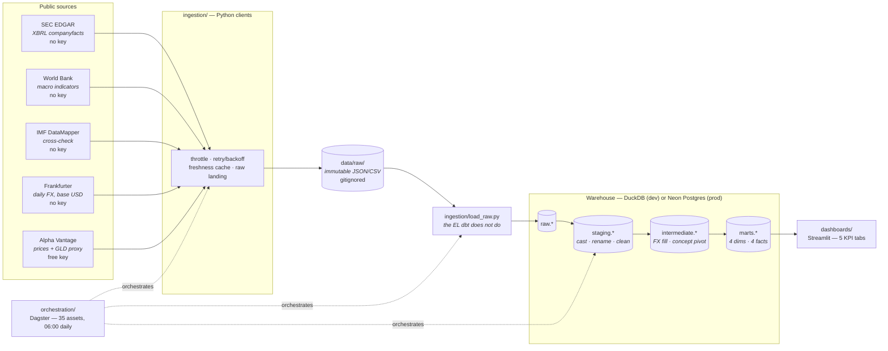
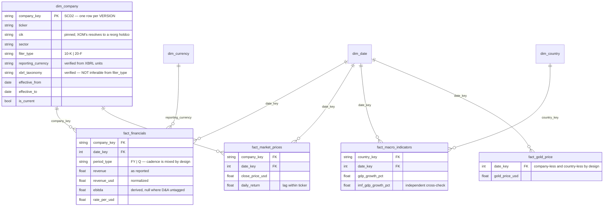

# Architecture

Rendered as Mermaid rather than a committed image: GitHub renders it inline, it stays diffable
in version control, and it cannot silently go stale the way an exported PNG does.

## Pipeline

## Star schema

Conformed dimensions are shared across facts, which is what lets a single query join filing
fundamentals, daily prices and country macro together.

## Why the pieces are where they are

| Decision | Reason |
|---|---|
| Raw lands as **files**, not straight to the warehouse | Extraction stays re-runnable and the warehouse rebuildable without re-hitting rate-limited APIs. |
| A **Python loader** rather than SQL reading files | DuckDB can read local JSON; hosted Postgres cannot. Parsing in Python keeps the dbt models byte-identical across both targets. |
| **dbt** owns transformation only | Models are tested and versioned; the loader owns the EL that dbt deliberately does not do. |
| `dim_date` carries **calendar** attributes only | Five fiscal calendars in the universe — a shared fiscal column would be wrong for most companies, so fiscal period travels on the fact. |
| `fact_gold_price` joins **only** on `dim_date` | It is a single global series, a cross-cutting benchmark rather than a per-holding measure. |
